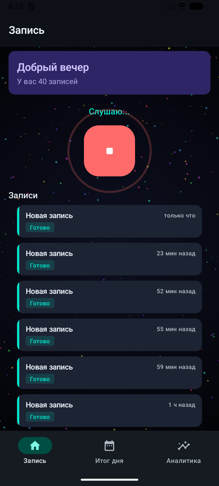
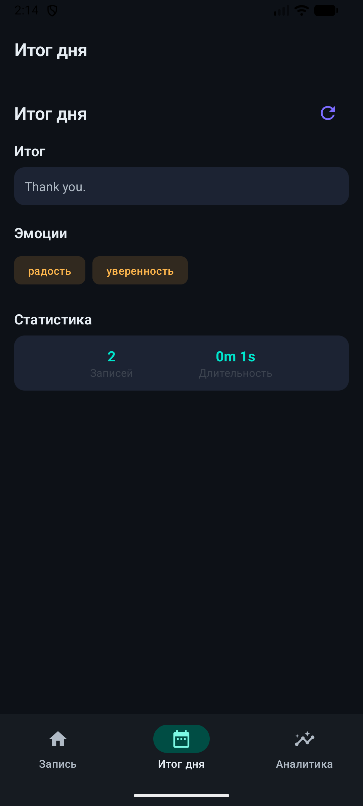
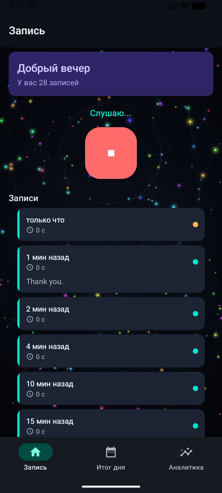
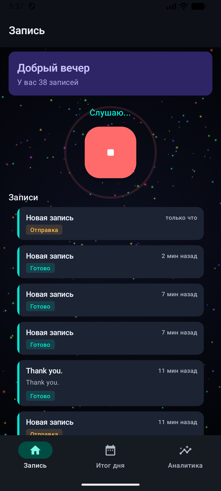

# Reflexio 24/7

**AI-powered voice diary & daily cognitive digest**
*Умный голосовой дневник с AI-анализом и ежедневным когнитивным дайджестом*


<p align="center">
  
  &nbsp;&nbsp;
  
  &nbsp;&nbsp;
  
</p>

---

## What is Reflexio? / Что такое Reflexio?

Reflexio записывает речь 24/7 на телефоне, распознает только голос (игнорирует тишину, музыку, ТВ), транскрибирует через Whisper, анализирует через LLM и вечером выдает **дневной когнитивный дайджест** — что говорил, что чувствовал, какие решения принимал.

Это пассивный когнитивный ассистент: превращает поток речи в осмысленную дневную сводку с эмоциями, задачами и социальным графом.

---

## Architecture / Архитектура

```
Android (Kotlin)              Backend (FastAPI)              Output
+-----------------+          +---------------------+        +------------------+
| Microphone      |   HTTP   | /ingest/audio       |        | Daily Digest     |
| VAD Filter  ----+--------->| Whisper ASR         |------->| Emotion Analysis |
| Auto-upload     |          | LLM Analysis        |        | Social Graph     |
| Local cleanup   |          | SQLite / Supabase   |        | Task Extraction  |
+-----------------+          +---------------------+        +------------------+
```

---

## Features / Возможности

- **Voice Activity Detection** — запись только речи, пропуск тишины/музыки/шума
- **Speaker Diarization** — разделение говорящих (кто говорил)
- **Whisper ASR** — транскрипция через faster-whisper (local)
- **LLM Digest** — ежедневная сводка с эмоциями и задачами (OpenAI / Anthropic)
- **Social Graph** — автоматическое построение графа контактов из речи (KuzuDB)
- **Compliance Layer** — PII-маскирование, TTL, zero-retention аудио
- **Balance Wheel** — визуализация жизненного баланса на Android
- **Docker Deploy** — production-ready с Caddy, Redis, Vault

---

## Quick Start / Быстрый запуск

### Docker (рекомендуемый)

```bash
git clone https://github.com/sergeeey/24-na-7.git
cd 24-na-7
cp .env.example .env   # заполнить API ключи
docker compose up -d
curl http://localhost:8000/health
```

### Local development

```bash
python -m venv venv && source venv/bin/activate
pip install -e ".[dev]"
uvicorn src.api.main:app --reload --host 0.0.0.0 --port 8000
```

Android-приложение: `android/` — открыть в Android Studio, собрать APK.

---

## Tech Stack / Стек

| Layer | Technology |
|-------|-----------|
| Mobile | Kotlin, Jetpack Compose, Material 3 |
| Backend | Python 3.11+, FastAPI, Pydantic |
| ASR | faster-whisper (local inference) |
| LLM | OpenAI GPT / Anthropic Claude |
| Database | SQLite (dev) / Supabase (prod) |
| Graph DB | KuzuDB (social graph) |
| Queue | Redis + APScheduler |
| Secrets | HashiCorp Vault |
| Deploy | Docker Compose, Caddy, systemd |
| Security | SAFE validation, CoVe, PII masking |

---

<details>
<summary><strong>Project Structure / Структура проекта</strong></summary>

```
24-na-7/
├── android/                # Kotlin Android app (Jetpack Compose)
│   └── app/src/main/kotlin/com/reflexio/app/
│       ├── ui/             # Screens, components, Balance Wheel
│       ├── domain/         # Use cases, models
│       ├── data/           # API client, repositories
│       └── debug/          # Debug tools
├── src/
│   ├── api/                # FastAPI endpoints
│   │   └── main.py         # /ingest/audio, /digest, /health
│   ├── edge/               # Edge listener (VAD + upload)
│   │   └── listener.py
│   ├── asr/                # Whisper transcription
│   ├── digest/             # Daily digest generation
│   ├── social_graph/       # Speaker graph (KuzuDB)
│   ├── compliance/         # PII masking, TTL, audit
│   ├── utils/              # Config, logging, guards
│   └── storage/            # File & DB storage
├── tests/                  # 40+ pytest tests
├── digests/                # Generated daily digests (JSON + MD)
├── docs/                   # Documentation & screenshots
├── config/                 # Environment configs
├── scripts/                # Launch & check scripts
├── docker-compose.yml      # Dev deployment
├── docker-compose.prod.yml # Production deployment
├── Dockerfile.api          # API container
├── Dockerfile.worker       # Worker container
├── Caddyfile               # Reverse proxy config
└── pyproject.toml          # Python dependencies
```
</details>

---

<details>
<summary><strong>Screenshots / Скриншоты</strong></summary>

| Home Screen | Daily Digest | Smart Cards | Balance Wheel |
|:-----------:|:------------:|:-----------:|:-------------:|
|  |  |  |  |

<details>
<summary>All screenshots (23)</summary>

| Screenshot | File |
|-----------|------|
| After Splash | `reflexio_after_splash.png` |
| After Tap | `reflexio_after_tap.png` |
| Clean Cards | `reflexio_clean_cards.png` |
| Clean Cards v2 | `reflexio_clean_cards2.png` |
| Dark Theme | `reflexio_dark_theme.png` |
| Deployed | `reflexio_deployed.png` |
| Digest Deployed | `reflexio_digest_deployed.png` |
| Digest v2 | `reflexio_digest_v2.png` |
| Digest v2b | `reflexio_digest_v2b.png` |
| Digest v2c | `reflexio_digest_v2c.png` |
| Digest v2d | `reflexio_digest_v2d.png` |
| Enrichment | `reflexio_enrichment.png` |
| Home v2 | `reflexio_home_v2.png` |
| New Design | `reflexio_new_design.png` |
| Smart Cards | `reflexio_smart_cards.png` |
| Splash | `reflexio_splash.png` |
| Splash v2 | `reflexio_splash2.png` |
| Splash v3 | `reflexio_splash3.png` |
| v3 | `reflexio_v3.png` |
| v4 FAB | `reflexio_v4_fab.png` |
| v5 Border | `reflexio_v5_border.png` |
| v6 Teal | `reflexio_v6_teal.png` |
| v7 Polish | `reflexio_v7_polish.png` |

All screenshots are in [`docs/screenshots/`](docs/screenshots/).
</details>
</details>

---

## API Endpoints

| Method | Path | Description |
|--------|------|-------------|
| `GET` | `/health` | Health check |
| `POST` | `/ingest/audio` | Upload audio segment |
| `POST` | `/asr/transcribe?file_id=...` | Transcribe uploaded file |
| `GET` | `/ingest/status/{id}` | Processing status |
| `GET` | `/digest/today` | Today's digest |
| `GET` | `/digest/{date}` | Digest by date (YYYY-MM-DD) |
| `GET` | `/digest/{date}/density` | Information density analysis |

---

## Documentation / Документация

| Doc | Description |
|-----|-------------|
| [QUICKSTART.md](docs/QUICKSTART.md) | Step-by-step launch guide |
| [DEPLOYMENT.md](docs/DEPLOYMENT.md) | Production deployment |
| [SECURITY.md](docs/SECURITY.md) | Security policy (SAFE, CoVe, PII) |
| [DIGEST.md](docs/DIGEST.md) | Digest system documentation |
| [API_KEYS_SETUP.md](docs/ENV_SETUP_INSTRUCTIONS.md) | API keys & env configuration |
| [USER_GUIDE_DEMO.md](docs/USER_GUIDE_DEMO.md) | User guide & demo |
| [RUNBOOKS.md](docs/RUNBOOKS.md) | Incident runbooks |

---

## License

MIT

## Author

Sergey Kucherenko — [@sergeeey](https://github.com/sergeeey)
