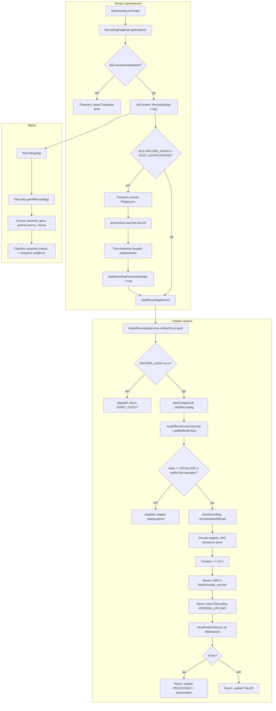

# Алгоритм работы Android-приложения Reflexio

Описание целевого потока приложения: запуск, разрешения, фоновый сервис записи, VAD, сохранение и отправка сегментов на бэкенд.

## Диаграмма потока



## Пошаговый алгоритм

1. **Старт.** MainActivity поднимает БД Room (`RecordingDatabase.getInstance`). При ошибке — показ экрана «Database error» и выход.

2. **Разрешения.** Если нет RECORD_AUDIO (и на API 33+ POST_NOTIFICATIONS) — показывается блок «Для записи нужен доступ к микрофону» и кнопка «Разрешить». По выдаче разрешений обновляется `hasRecordingPermissionState` и вызывается `startRecordingService()`.

3. **Сервис.** В `onStartCommand` проверяется RECORD_AUDIO. При отсутствии — `stopSelf()`, без вызова `startForeground` (избегаем SecurityException). При наличии — переход в foreground и `startRecording()`.

4. **Запись.** Инициализация `AudioRecord` (MIC, 16 kHz, моно, 16 bit). Проверяются:
   - `AudioRecord.getMinBufferSize()` — не должен возвращать ERROR (-2) или ERROR_BAD_VALUE (-3);
   - `audioRecord.state == AudioRecord.STATE_INITIALIZED`.
   При невалидном буфере или неинициализированном состоянии — лог, `stopSelf()`, сервис завершается (микрофон отсутствует или занят).

5. **VAD.** Кадры по 320 сэмплов обрабатываются VadSegmentWriter; после 300 ms тишины завершённый сегмент не короче 0.5 с записывается в WAV и в Room со статусом PENDING_UPLOAD.

6. **Отправка.** Для каждой такой записи вызывается `sendAudioToServer`: WebSocket к `baseUrl/ws/ingest`, отправка бинарного WAV. В ответ — `received`, затем `transcription` или `error`. По результату запись в Room обновляется в PROCESSED (с текстом) или FAILED.

7. **UI.** RecordingApp подписан на `getAllRecordings()`; отображает список (дата, длительность, статус). При ошибке сбора — текст в loadError.

## Граничные случаи

| Сценарий | Поведение |
|----------|-----------|
| Нет разрешения на микрофон | Сервис не переводится в foreground, не крашится; в UI — кнопка «Разрешить». |
| RECORD_AUDIO отозвано во время работы | При следующем вызове `onStartCommand` проверка разрешения, при отсутствии — `stopSelf()`. |
| Микрофон недоступен (устройство/занят) | Проверка `getMinBufferSize` и `state`; при ошибке — `stopSelf()`, сервис завершается. |
| Нет сети при отправке | WebSocket failure → запись переводится в FAILED, ошибка в логах. |
| БД недоступна при старте | Экран с текстом ошибки БД. |
| Пустой/невалидный аудио на бэкенде | `/ws/ingest`: пустое тело — ответ `type: error`; невалидный WAV — `received`, затем `error` от транскрибера. |
| Эмулятор без реального микрофона | VAD может не обнаруживать речь; тестировать на реальном устройстве или использовать эмуляцию аудио в Android Studio. |

## Тестирование

### На эмуляторе

**Важно:** Эмулятор может не иметь доступа к реальному микрофону компьютера. Если записи не появляются:

1. **Проверить логи:**
   ```powershell
   adb logcat -d | Select-String "AudioRecordingService|VAD|segment"
   ```
   Должны быть логи:
   - `"Starting VAD recording loop"`
   - `"Recording: X frames processed"`
   - `"VAD detected speech segment"` (если есть речь)

2. **Если в логах «0 speech frames»:**
   - VAD не считает ни один кадр речью (типично для эмулятора: тишина или шум с виртуального микрофона).
   - В debug-сборке используется режим VAD NORMAL (чувствительнее); говори чётко и громко в микрофон ПК (эмулятор берёт звук с хоста).
   - Надёжная проверка: тест на реальном устройстве с микрофоном.

3. **Если сегменты создаются, но не сохраняются:**
   - Проверить логи: `"Segment saved to DB: id=..."`
   - Проверить Room Database через Device File Explorer

### На реальном устройстве

1. Убедиться, что разрешения выданы (RECORD_AUDIO, POST_NOTIFICATIONS)
2. Говорить в микрофон устройства
3. Проверить логи через `adb logcat`
4. Проверить UI — записи должны появиться через несколько секунд после речи

## Связанные файлы

- **UI:** `android/app/src/main/kotlin/com/reflexio/app/ui/MainActivity.kt`
- **Сервис записи:** `android/app/src/main/kotlin/com/reflexio/app/domain/services/AudioRecordingService.kt`
- **VAD:** `android/app/src/main/kotlin/com/reflexio/app/domain/vad/VadSegmentWriter.kt`
- **Сеть:** `android/app/src/main/kotlin/com/reflexio/app/domain/network/IngestWebSocketClient.kt`
- **Протокол WebSocket:** [WEBSOCKET_PROTOCOL.md](WEBSOCKET_PROTOCOL.md)
